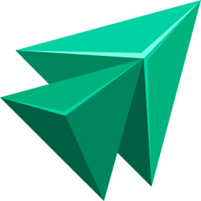
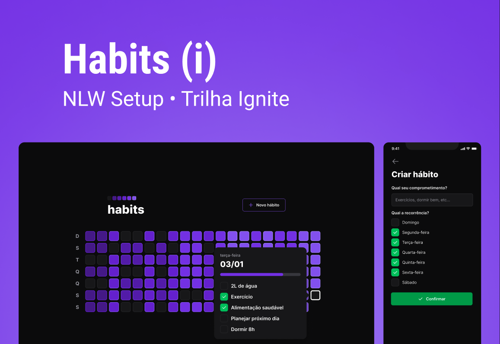

<!-- <div align="center">  </div> -->
<div align="center"> </div>

#

<p align="center">
 NLW Setup Ignite  - Rocketseat 🚀 <br/>
</p>

<p align="center">
  <a href="#-tecnologias">Tecnologias</a>&nbsp;&nbsp;&nbsp;|&nbsp;&nbsp;&nbsp;
  <a href="#-projeto">Projeto</a>&nbsp;&nbsp;&nbsp;|&nbsp;&nbsp;&nbsp;
  <a href="#-layout">Layout</a>&nbsp;&nbsp;&nbsp;|&nbsp;&nbsp;&nbsp;
  <a href="#memo-licença">Licença</a>
</p>

<p align="center">
  
</p>

<br>

<p align="center">
  
</p>

## 🧪 Technologies

This project was developed using the following technologies:

-   [NodeJS](https://nodejs.org/)
-   [TypeScript](https://www.typescriptlang.org/)
-   [Fastify](https://www.fastify.io/)
-   [Prisma](https://www.prisma.io/)
-   [ViteJS](https://vitejs.dev/)
-   [ReactJS](https://reactjs.org/)
-   [TailwindCSS](https://tailwindcss.com/)
-   [React Native](https://reactnative.dev/)
-   [React Native SVG](https://docs.expo.dev/versions/latest/sdk/svg/)
-   [SVG Transformer](https://github.com/kristerkari/react-native-svg-transformer)
-   [Phosphor-icons](https://...)
-   [vector-icons](https://...)

-   [Expo](https://expo.io/)

## 🧪 SOLID

Principles:

-   Single Responsibility Principle: Each class has a unique responsibility;
-   Open/Closed Principle: Application classes must be open for extension but closed for modification;
-   Liskov Substitution Principle: We should be able to replace a parent class with an inheritance from it and everything still works;
-   Interface Segregation Principle: Segregate Interfaces;
-   Dependency Inversion Principle: Instead of the class fetching the dependencies it needs, the context informs the class of the required dependencies;
-   Git e Github
-   Figma

    **IDE:** Visual Studio Code

    -   🎨  **Tema**: [Rosé Pine](https://marketplace.visualstudio.com/items?itemName=mvllow.rose-pine)
    -   ⚙️  **Extensões usadas no NLW**
        -   [Tailwind CSS IntelliSense](https://marketplace.visualstudio.com/items?itemName=bradlc.vscode-tailwindcss)
        -   [DotENV](https://marketplace.visualstudio.com/items?itemName=mikestead.dotenv)
        -   [Prisma](https://marketplace.visualstudio.com/items?itemName=Prisma.prisma)
        -   [Fluent Icons](https://marketplace.visualstudio.com/items?itemName=miguelsolorio.fluent-icons)
        -   [Symbols](https://marketplace.visualstudio.com/items?itemName=miguelsolorio.symbols)
        -   [Console Ninja](https://marketplace.visualstudio.com/items?itemName=WallabyJs.console-ninja)

-   **Navegador**
    -   JSON Viewer

## 💻 Projeto

O Habits é um app para ajudar a rastrear os hábitos.

-   [Visite o projeto online](https://AndressaDaCosta/github.io/nlw-setup-ignite)

## 🚀 Getting started

Clone the project and access the folder.

```bash
$ git clone https://github.com/AndressaDaCosta/nlw-setup-ignite.git
$ cd nlw-setup-ignite
```

Follow the steps below:

### Web

```bash
# Install the web dependencies
$ cd web
$ npm install
# Start the web project
$ npm start
```

### Server

```bash
# Install the server dependencies
$ cd server
$ npm install
# Start the server project
$ npx prisma migrate deploy
$ npm run dev
```

### Mobile

```bash
# Install the mobile dependencies
$ cd mobile
$ npm install
# Start the mobile project
$ npm start
```

## 🔖 Layout

You can view the project layout through the links below:

-   [Layout](https://www.figma.com/community/file/1195326661124171197)

Remembering that you need to have a [Figma](http://figma.com/) account to access it.

---

Feito com ♥ by Rocketseat 🚀 [Participe da nossa comunidade!](https://discord.gg/rocketseat)
